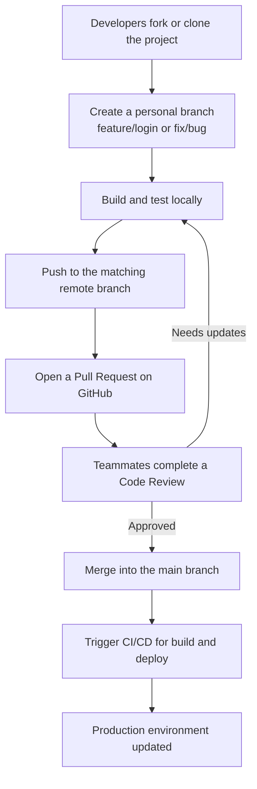
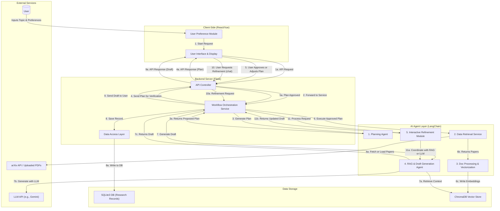

# Project Template

## Tech Stack
- React for the browser experiences.
- Flask for backend.
- LangChain-driven agents for planning, retrieval, document processing, RAG drafting, and refinement loops.
- SQLite for transactional data, ChromaDB for vector search, plus arXiv API and an LLM provider such as Gemini.

## Repository Layout
```text
.
|-- client/                     # React application shell (routing, state, API clients)
|   |-- public/
|   |-- src/
|   |   |-- components/         # Shared layout widgets and navigation
|   |   |-- hooks/              # Custom React hooks (for example, user preferences)
|   |   |-- pages/              # Route-level feature placeholders
|   |   |-- services/           # HTTP clients and orchestration helpers
|   |   `-- store/              # Context-based state container
|   `-- package.json            # Client dependencies and scripts
|-- server/                     # Flask application (controllers, services, data access)
|   |-- config/
|   |-- controllers/
|   |-- data_access/
|   |-- models/
|   |-- services/
|   `-- tests/
|-- ai_agents/                  # LangChain agent abstractions (planning, RAG, refinement)
|-- storage/                    # SQLite and ChromaDB helpers and seed scripts
|-- scripts/                    # Developer utilities for setup automation
|-- requirements.txt            # Python dependencies for backend and agents
`-- .env.example                # Environment variable template
```

## Layer Responsibilities
- **Client (React)**: Captures user preferences, surfaces AI-generated plans, renders draft output, and hosts the refinement chat UI.
- **Backend Server (Flask)**: Validates requests, orchestrates cross-layer workflows, persists state, and exposes REST endpoints consumed by the client.
- **AI Agent Layer (LangChain)**: Encapsulates the Planning Agent, Retrieval Service, Document Processor, RAG Agent, and Refinement Module as injectable services.
- **Data Storage**: `storage/sqlite` manages structured research records, while `storage/vector_store` provides a gateway to ChromaDB embeddings.
- **External Services**: Integrate with arXiv (and uploaded PDFs) for sources and an LLM provider for reasoning and drafting.

## Request Lifecycle (High Level)
1. The client collects a topic and preference payload and posts it to `/api/requests`.
2. The Flask controller delegates to `OrchestrationService.plan_research_workflow`, which records metadata and calls the Planning Agent.
3. Once approved, orchestration coordinates Retrieval -> Document Processing -> RAG draft generation while streaming progress back to the UI.
4. Drafts and research records are saved via the `ResearchRepository` and exposed through `/api/requests/<id>/draft`.
5. Interactive refinement loops route through the Refinement Module, updating both the draft and persisted history.

## Environment Setup
- **Server**
  1. Create a Python 3.11 virtual environment.
  2. Install dependencies: `pip install -r requirements.txt`.
  3. Copy `.env.example` to `.env` and supply real keys (LLM, arXiv, and so on).
  4. Run the app in dev mode: `FLASK_ENV=development flask --app server.app run`.
- **Client**
  1. `cd client` and run `npm install` (or `npm ci` when using the lockfile).
  2. Start the dev server with `npm start` (CRA default port 3000 with `/api` calls proxied to Flask at 5000).
- **AI and Storage**
  - Populate SQLite and Chroma once seed scripts are implemented: `python storage/seeds/seed_data.py`.
  - Add LangChain configuration (models, vector store) inside the corresponding agent constructors.

## Configuration Notes
- Update `server/config/settings.py` when new environment flags or service URLs are introduced.
- Use `storage/sqlite/database.py` as the single entry point for database connections (swap for SQLAlchemy as needed).
- `storage/vector_store/chroma_client.py` centralizes Chroma connection logic so different agents can share a collection.

## Testing
- Pytest scaffold lives in `server/tests/`; extend coverage as endpoints and services gain implementations.
- Add client-side tests (for example, Vitest and React Testing Library) once components host real logic.

## Development Workflow (GitHub)


## System Architecture Diagram

## Docker Deployment
1. Copy `.env.example` to `.env` and provide real credentials before starting the stack.
2. Build and launch the containers with `docker compose up --build`.
3. Open `http://localhost:3000` to view the client shell. The Flask API is exposed at `http://localhost:5500/api/health`.
4. Code changes under `server/`, `ai_agents/`, and `storage/` are mounted into the backend container for live reload; rebuild the client image (`docker compose build frontend`) if you adjust npm dependencies.
5. The `vectorstore` service provisions a ChromaDB instance and keeps data in the `chroma_data` named volume. Remove containers and volumes with `docker compose down -v` when you want a clean slate.

### Docker Environment Notes
- The CRA dev server reads the `proxy` setting in `client/package.json` so that `/api` requests reach the Flask backend (`backend:5000`) inside Docker. From the host machine you can reach the API at `http://localhost:5500`.
- Update the port bindings in `docker-compose.yml` if port `3000` is already in use on your machine.
- Swap in a production-ready WSGI server (for example, Gunicorn or Uvicorn) before deploying beyond development.
