# Project Template

## Tech Stack
- React + Material UI for the browser experience (single-page planner in `client/src/App.js`).
- Flask backend that exposes `/api/*` routes for search, chat, summaries, keyword expansion, and deep research.
- Gemini-backed custom agents inside `ai_agents/` for conversation, summarization, keyword expansion, and multi-round research.
- SQLite for transactional data and cached artifacts (stored under `storage/`).

## Repository Layout
```text
.
|-- client/                     # React SPA: basic pages & layout
|   |-- src/
|   |   |-- components/         # AppLayout, Sidebar
|   |   |-- pages/              # Auth, Home, PlanReview, ResearchDashboard
|   |   |-- services/           # apiClient, authApi, orchestrationService
|   |   |-- store/              # (reserved for state management)
|
|-- server/                     # Flask backend
|   |-- app.py                  # Flask app entrypoint
|   |-- config/
|   |   |-- settings.py         # Environment & app settings
|   |-- controllers/
|   |   |-- api_controller.py   # Search, conversation, deep research endpoints
|   |   |-- auth_controller.py  # /auth/register, /auth/login
|   |-- services/
|   |   |-- academic_search.py  # OpenAlex-based search
|   |   |-- ai_conversation_service.py  # Wraps ConversationAgent
|   |   |-- deep_research_service.py    # Orchestrates deep research workflow
|   |   |-- docling_service.py          # PDF ingestion (Docling/PyMuPDF)
|   |   |-- pdf_cache_service.py        # PDF download & cache
|   |   |-- auth_service.py             # JWT auth, password hashing
|   |   |-- search_extension_tool.py    # Backend-side search extension tool
|   |-- data_access/
|   |   |-- user_repository.py
|   |   |-- paper_repository.py
|   |   |-- search_history_repository.py
|   |   |-- conversation_repository.py
|   |   |-- summary_repository.py
|   |-- models/
|       |-- research_request.py         # Request/data models
|
|-- ai_agents/                  # AI service layer (LLM + tools + agents)
|   |-- llm/
|   |   |-- gemini_client.py    # Unified Gemini client
|   |-- services/
|       |-- models.py           # AI-side models (PaperSummary, ConversationSession, etc.)
|       |-- tooling.py          # AgentTool, ToolContext, ToolRegistry
|       |-- summarizer.py       # PaperSummarizer + SummarizerTool
|       |-- query_refiner.py    # KeywordExpansionTool
|       |-- focused_synthesis.py# FocusedSynthesisTool
|       |-- search_list_manager.py # Session-level paper catalogue
|       |-- session_memory.py   # Conversation history & memory
|       |-- conversation_agent.py# Core AI chat agent
|       |-- deep_research.py    # DeepResearchAgent
|       |-- pdf_builder.py      # SummaryPdfBuilder (PDF export)
|
|-- storage/
|   |-- sqlite/                 # SQLite DB (file-based)
|   |-- vector_store/           # ChromaDB client scaffold (TODO)
|
|-- docker-compose.yml
|-- requirements.txt            # Python deps
|-- package.json                # JS deps
|-- .env.example                # Example env config
```

## Layer Responsibilities
- **Client (React)**: Captures the research topic, runs AI keyword expansion, displays search results, manages conversation/deep-research UI, and handles local auth state.
- **Backend Server (Flask)**: Handles authentication, executes OpenAlex searches, persists histories/selections, brokers AI chat & summaries, orchestrates PDF ingestion, and coordinates deep research runs.
- **AI Agent Layer**: Houses conversation, summarization, keyword-expansion, and deep-research agents (Gemini-powered) that the server invokes via thin adapters.
- **Data Storage**: SQLite tables under `storage/sqlite` track users, histories, sessions, summaries, and cached PDFs/fulltext.
- **External Services**: OpenAlex for paper metadata, Docling for PDF parsing, and Gemini for reasoning/synthesis.

## Request Lifecycle (High Level)
1. The client collects keywords (optionally expanded via `/api/keywords/expand`) and calls `POST /api/normal_search`. Authenticated searches create a history record plus selectable paper list.
2. Users can start an AI chat (`POST /api/chat/sessions`) tied to that history; subsequent `POST /api/chat/sessions/<id>/messages` exchanges yield answers, suggested papers, and optional PDF summaries.
3. Deep research actions (`POST /api/deep_research`) consume the selected papers and run multi-round analysis with follow-up OpenAlex lookups. Additional PDFs can be attached through `/api/deep_research/upload`.
4. Summaries can be requested explicitly (`POST /api/summaries`) or triggered from chat replies; they are stored and downloadable via `/api/chat/sessions/<id>/summaries/*`.
5. Traditional `/api/requests/*` endpoints remain for future workflow orchestration but the current UI primarily uses the normal-search/chat/deep-research flows.

## AI Chat Usage Examples
- `list my current selection` → shows which papers are currently marked for chat/deep research.
- `find more about compute-efficient LLM training` → invokes the search extension tool to pull additional OpenAlex papers on that topic.
- `remove paper 2 and paper 4 from the selection` → drops the specified papers from the working set (and persists the change).
- `focus on safety benchmarks when summarizing` → asks the agent to center its reply on a specific aspect of the selected corpus.
- `cite the papers about reinforcement learning safety` → returns formatted references for the relevant papers.
- `summarize the papers`  → produces concise or detailed summaries with citations and (when applicable) downloadable PDFs.

## Environment Setup
- **Server**
  1. Create a Python 3.11 virtual environment.
  2. Install dependencies: `pip install -r requirements.txt`.
  3. Copy `.env.example` to `.env` and provide Gemini + OpenAlex mail identifiers (and any DB paths).
  4. Run `FLASK_ENV=development flask --app server.app run` (CORS is enabled for `/api/*`).
- **Client**
  1. `cd client` then `npm install` (or `npm ci`).
  2. `npm start` launches CRA on port 3000 with proxy to Flask at 5000.
- **AI and Storage**
  - SQLite databases and cached PDFs live under `storage/`. Ensure the folder is writable before running Docling ingestion or generating summary PDFs.

## Configuration Notes
- Add new flags/endpoints in `server/config/settings.py`.
- Use `storage/sqlite/database.py` for connection management when augmenting repositories.
- Gemini/OpenAlex credentials are read from the environment; adjust `ai_agents/` constructors if the provider changes.

## API Endpoints

- Health check: `GET /api/health`
- Auth: `POST /api/auth/register`, `POST /api/auth/login`
- Create research request: `POST /api/requests`
- Approve plan: `PATCH /api/requests/<id>/approval`
- Get draft: `GET /api/requests/<id>/draft`
- Refine draft: `POST /api/requests/<id>/refine`

- Keyword expansion: `POST /api/keywords/expand`
- Normal academic search: `POST /api/normal_search`
  - Request body schema (JSON):
    ```
    {
      "keywords": string[],              // required
      "date_range": [string, string] |
                    { "start": string, "end": string } |
                    null,
      "concepts": string[] | null,
      "limit": number
    }
    ```
  - Response body schema (200 OK):
    ```
    {
      "results": [
        {
          "id": string,
          "title": string,
          "authors": string[],
          "summary": string,
          "publication_date": string,
          "publication_year": number,
          "source": string,
          "cited_by_count": number,
          "link": string,
          "pdf_url": string
        }
      ],
      "history_id": number?              // when user is authenticated
    }
    ```

- Search history: `GET /api/search/history`, `GET /api/search/history/<id>`
- Persist selection: `POST /api/search/history/<id>/selection`
- Load session from history: `POST /api/search/history/<id>/session`

- Chat sessions: `POST /api/chat/sessions`, `GET /api/chat/sessions/<id>`
- Chat messages: `POST /api/chat/sessions/<id>/messages`
- Summaries: `POST /api/summaries`, `GET /api/chat/sessions/<id>/summaries`,
  `GET /api/chat/sessions/<id>/summaries/<summary_id>/download`

- Deep research: `POST /api/deep_research`
  - Requires `history_id`, selected paper IDs, prompt/instructions, and optional tuning parameters (`rounds`, `breadth`, `per_query_limit`).
- Deep research upload: `POST /api/deep_research/upload` (multipart PDF files tied to a history)

## Testing / Tooling Notes
- Run backend tests with `pytest server/tests`.
- Use `scripts/check_db.py` or similar helpers for quick diagnostics.
- Generated summary PDFs live under `storage/summary_pdfs`; cached PDFs and Docling outputs sit inside `storage/` as well.

## System architecture

```mermaid

flowchart TD

%% ================= Client & User ================
subgraph Client["Client (React Web App)"]
    UI["Search & Results UI"]
    ChatUI["Chat & Summary UI"]
    AuthUI["Auth UI"]
end

subgraph UserSide["User"]
    EndUser["User (Browser)"]
end

EndUser --> UI
EndUser --> ChatUI
EndUser --> AuthUI

%% ================= Backend ================
subgraph Backend["Backend Server (Flask)"]
    API["API Controller (api_blueprint)"]
    AuthCtrl["Auth Controller"]
    Orchestrator["OrchestrationService (stub)"]

    subgraph SvcLayer["Service Layer"]
        SearchSvc["AcademicSearchService"]
        ConvSvc["AIConversationService"]
        Docling["DoclingIngestionService"]
        PdfCacheSvc["PDFCacheService"]
        SummaryPdf["SummaryPdfBuilder"]
        AuthSvc["AuthService"]
        SearchToolSvc["SearchExtensionTool"]
    end

    subgraph RepoLayer["Data Access / Repositories"]
        PaperRepo["PaperRepository"]
        HistRepo["SearchHistoryRepository"]
        ConvRepo["ConversationRepository"]
        SummaryRepo["SummaryRepository"]
        UserRepo["UserRepository"]
    end
end

%% Client <-> Backend
UI -->|"search & history REST"| API
ChatUI -->|"chat, summaries REST"| API
AuthUI -->|"register, login"| AuthCtrl

API -->|"POST /normal_search"| SearchSvc
API -->|"GET/POST search history, sessions"| SearchSvc
API -->|"chat sessions & messages"| ConvSvc
API -->|"summaries API"| ConvSvc
API -->|"auth calls"| AuthSvc
API -->|"research requests (not implemented)"| Orchestrator

AuthCtrl -->|"register/login"| AuthSvc

%% ================= AI Agent Layer ================
subgraph AI["AI Agent Layer (LangChain-style)"]
    ConvAgent["ConversationAgent"]
    ToolReg["ToolRegistry"]
    KwTool["KeywordExpansionTool"]
    QuickTool["QuickSummaryTool"]
    GlobalTool["GlobalSummaryTool"]
    FocusTool["FocusedSynthesisTool"]
    SearchTool["SearchExtensionTool (AI Tool)"]
    Mem["SessionMemory"]
    SearchMgr["SearchListManager"]
    Summarizer["PaperSummarizer"]
    GeminiClient["GeminiClient"]
end

%% Backend <-> AI layer
ConvSvc -->|"create / load sessions"| ConvAgent
ConvSvc -->|"register_tool(search_extension)"| ConvAgent
ConvSvc -->|"AgentReply (text, citations, ids)"| API

ConvAgent -->|"tool calls"| ToolReg
ToolReg --> KwTool
ToolReg --> QuickTool
ToolReg --> GlobalTool
ToolReg --> FocusTool
ToolReg --> SearchTool

ConvAgent --> Mem
ConvAgent --> SearchMgr

QuickTool --> Summarizer
GlobalTool --> Summarizer
FocusTool --> Summarizer
Summarizer -->|"LLM prompt/response"| GeminiClient

SearchTool -->|"search_and_append"| SearchSvc

%% ================= Data Storage ================
subgraph Storage["Data Storage"]
    subgraph DB["SQLite DB (storage/sqlite/research.db)"]
        SQLite["SQLite (research records, users, history, conversations, summaries)"]
    end
    PdfCacheDir["PDF Cache (storage/pdf_cache)"]
    SummaryDir["Summary PDFs (storage/summary_pdfs)"]
    PromptsDir["Prompt Logs (storage/prompts)"]
    Chroma["ChromaVectorStore (placeholder, not implemented)"]
end

PaperRepo --> SQLite
HistRepo --> SQLite
ConvRepo --> SQLite
SummaryRepo --> SQLite
UserRepo --> SQLite

PdfCacheSvc -->|"write PDF files"| PdfCacheDir
SummaryPdf -->|"write summary PDFs"| SummaryDir
Summarizer -->|"debug prompts"| PromptsDir

%% ================= External Services ================
subgraph External["External Services"]
    OpenAlex["OpenAlex API (papers)"]
    PdfHosts["PDF Hosts / arXiv PDF URLs"]
    GeminiAPI["Gemini LLM API"]
end

SearchSvc -->|"HTTP request"| OpenAlex
PdfCacheSvc -->|"download PDF"| PdfHosts
Docling -->|"Docling + PyMuPDF libs"| PdfHosts

GeminiClient -->|"HTTP LLM calls"| GeminiAPI

%% Academic search pipeline
SearchSvc -->|"upsert papers"| PaperRepo
SearchSvc -->|"create history record"| HistRepo
SearchSvc -->|"cache PDFs"| PdfCacheSvc
SearchSvc -->|"enqueue for parsing"| Docling

Docling -->|"parsed full text, sections, tables"| PaperRepo

%% History -> AI conversation pipeline
ConvSvc -->|"load history with papers"| HistRepo
ConvSvc -->|"fetch fulltext map"| PaperRepo
ConvSvc -->|"ingest PaperSummary list"| ConvAgent

%% Conversation persistence & summaries
API -->|"save chat messages, sessions"| ConvRepo
API -->|"save summary metadata"| SummaryRepo
SummaryPdf -->|"called from chat/summary APIs"| API

%% Auth pipeline
AuthSvc -->|"user CRUD"| UserRepo

%% Optional / planned components (dashed)
style Orchestrator stroke-dasharray: 5 5
style Chroma stroke-dasharray: 5 5
```


